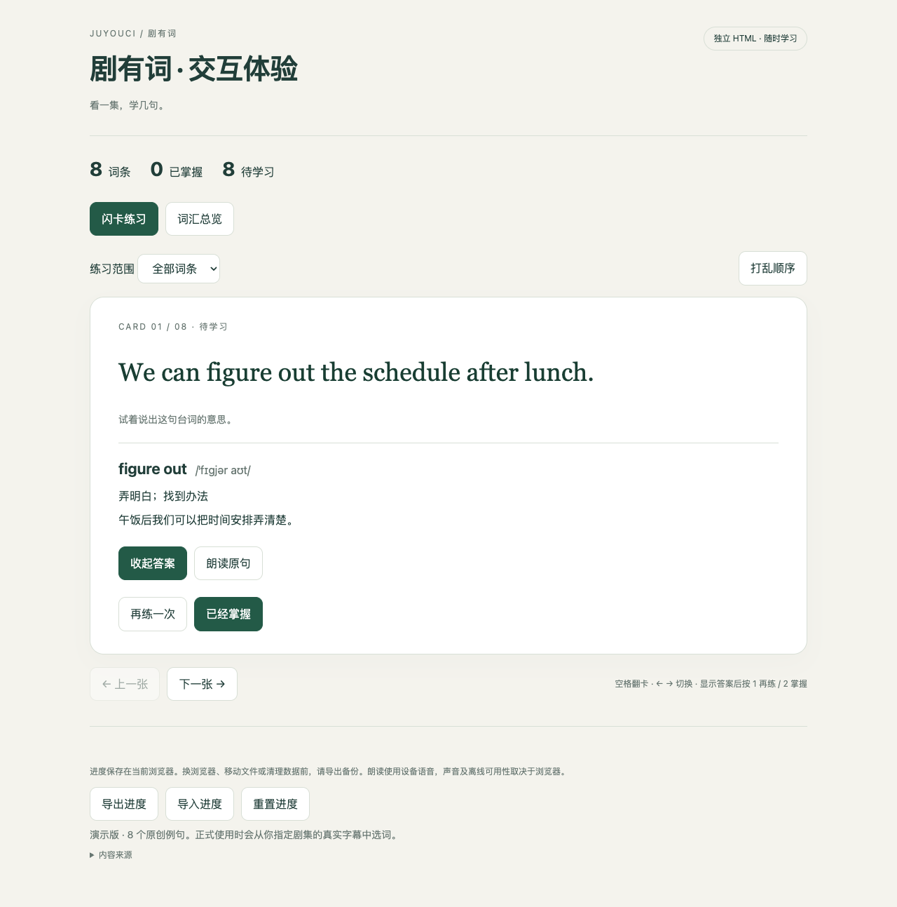

# 剧有词

**看一集，学几句。**

给出剧名 + 集数，AI 从实际字幕中挑选实用词汇，生成一个可直接打开的 HTML 学习页。无需 Anki，无需注册，无需启动服务器。

基于 [pyang5166/gbro-series-vocab](https://github.com/pyang5166/gbro-series-vocab) 改编。原版输出 Anki CSV 和 Markdown，本版将主要交付改为交互式 HTML。沿用 MIT 许可证，保留原作者 狗哥笔记 的版权声明。



## 能做什么

- 看英文原句，点击显示释义、音标与中文译文。
- 标记“已经掌握”或“再练一次”，筛选未掌握的词汇。
- 搜索词汇总览、打乱顺序、用键盘翻卡。
- 在当前浏览器保存进度，导出/导入 JSON 备份。
- 适配手机与电脑；设备支持时可朗读英文。

这是轻量词汇学习页，目前没有 Anki 的间隔重复排程算法。词汇数据、样式和代码都在单个 HTML 内；学习核心功能不依赖网络，语音是否可离线使用由设备决定。

## 安装到 Codex

```bash
git clone https://github.com/Chase-qisiai/juyouci.git ~/.codex/skills/juyouci
```

如果目标目录已存在，请先备份或合并，避免覆盖自己的配置。安装后新开一个 Codex 任务使用：

```text
使用 $juyouci，帮我生成 Breaking Bad S02E03 的 HTML 词汇学习页。
```

也可以直接提供英文字幕或剧本文字。AI 负责核实来源、筛词及翻译，生成脚本负责可靠地制作学习页。默认目标 50 条；字幕不足时如实交付实际数量。

## 先体验

下载 [demo.html](examples/demo.html)，用浏览器打开。示例中的 8 句英文均为原创演示句，不是真实剧集台词。

进度保存在当前浏览器；移动文件、更换浏览器或清理浏览器数据前，请先点击“导出进度”，再在新位置导入。浏览器禁止本地存储时会提示，仍然可以学习和导出。

## 手动生成

生成环节需要 Python 3，无需额外 Python 库。学习者只需浏览器。

```bash
python3 scripts/build_html.py examples/demo.json study.html
```

输入格式见 [数据格式](references/data-format.md)。HTML 不需要 JSON 文件伴随即可独立运行。

## 测试

```bash
python3 -m unittest discover -s tests -p 'test_*.py'
npm install
npm test
```

浏览器测试使用本机 Chrome（Playwright channel `chrome`）。覆盖翻卡、评分、刷新恢复、过滤空状态、搜索、进度导出/导入、重置、打乱、键盘、窄屏溢出和本地存储被禁用时的降级。生成器测试覆盖重复原句、缺字段、空数据、稳定 ID 和脚本注入转义。

2026-09-23：上述测试在 macOS + Chrome 通过；宽屏和 390px 窄屏截图已人工检查。没有对所有操作系统或浏览器做兼容性承诺，设备语音的实际声音未做听感验证。字幕网站能否获取取决于其当时可用性。

## 来源与版权

上游基线：`ed46e8491f6fd8a6f5501b74a5f68b488ecfb9ff`。来源获取参考保留在 `references/subtitle-sources.md`，站点行为可能随时变化，必须核实实际内容。仅输出选中的例句，不随学习页分发整集字幕。
