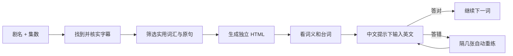

<div align="center">

# 剧有词

### 看一集，学几句。

给出美剧剧名和集数，生成一份可以直接打开的英语词汇学习页。

[下载体验页](https://github.com/Chase-qisiai/juyouci/raw/refs/heads/main/examples/demo.html) · [安装到 Codex](#安装到-codex) · [使用方法](#使用)


</div>

**剧有词**从指定剧集的真实字幕中挑选实用表达，生成独立 HTML。学习时先看词义和台词，再根据中文提示输入英文；答错的词会自动排回队列。

> 示例页使用 8 个原创句子演示功能，不来自任何剧集。

## 学习流程



每条词汇卡包括目标词、音标、语境释义、原句和译文。练习时目标词会从原句中挖空，网页自动检查输入答案。可接受的拼写或表达变体可以由生成内容明确列出。

## 安装到 Codex

macOS / Linux 上执行：

```bash
git clone --depth 1 https://github.com/Chase-qisiai/juyouci.git ~/.codex/skills/juyouci
```

如果已安装，进入技能目录执行 `git pull` 更新。安装后在新任务里这样使用：

```text
使用 $juyouci，为我生成 The Pitt S01E01 的 HTML 词汇学习页。
```

也可以直接把字幕或剧本文字提供给 Agent。其他支持 Skills 的 Agent，将整个仓库放入它的个人 Skills 目录即可。

## 使用

默认生成 50 条中文词汇，直接交付一个 HTML 文件。字幕材料不足时会按实际内容生成，不凑数量。已有字幕会直接使用；拿到一份可靠来源后就开始整理，不会为了收集多份来源而延长流程。

```text
用剧有词生成《The Pitt》S01E01 学习页，保存到下载文件夹。
```

双击生成的 HTML 即可学习。网页本身不依赖 Anki、服务器或网络；无需安装 Python。学习进度保存在当前浏览器，换浏览器或移动文件前可以导出备份。设备语音是否可用取决于浏览器。

## 适用范围

- 目前面向英美剧单集词汇学习。
- 字幕来源和内容必须能核实到指定剧集；找不到可靠字幕时，Agent 会请你提供字幕，不会凭记忆造台词。
- 只保存精选学习例句，不把整集字幕打包进网页。
- 网页支持单集练习与错词重练；目前不提供跨天的 FSRS / Anki 式复习排程。
- “本轮答对”表示这次输入正确，不代表已经长期记住。

## 手动生成

需要 Python 3 的标准库来把词汇 JSON 和页面模板合成 HTML；学习者只需浏览器。

```bash
python3 scripts/build_html.py examples/demo.json study.html
```

输入格式见 [references/data-format.md](references/data-format.md)。生成后的 HTML 不需要 JSON 或其他文件伴随。

## 项目结构

| 路径 | 用途 |
|---|---|
| `SKILL.md` | Agent 的触发条件与生成流程 |
| `assets/study.html` | 单文件学习页模板 |
| `scripts/build_html.py` | 校验词条并生成独立 HTML |
| `references/` | 字幕来源与词条格式说明 |
| `examples/demo.html` | 可直接打开的原创示例 |

## 维护者验证

模板或生成器改动时，可以运行：

```bash
python3 -m unittest discover -s tests -p 'test_*.py'
npm install && npm test
```

浏览器交互测试使用本机 Chrome 和 Playwright。最近一次输入判题流程更新尚未重新运行完整测试；之前的测试结果不代表当前版本已通过。设备语音也没有做听感验证。

## 来源与许可

本项目由 [pyang5166/gbro-series-vocab](https://github.com/pyang5166/gbro-series-vocab) 改编，将 Anki/Markdown 交付改为独立 HTML 学习页。保留上游 MIT 许可和原作者 狗哥笔记 的版权声明。TypeWords 的练习设计仅作参考，本仓库没有复制其 GPL-3.0 源代码。

## English

**Juyouci** turns a TV episode transcript into a self-contained HTML vocabulary practice page. Learners study each target word in context, recall it by typing from a Chinese prompt, and automatically revisit missed words. No Anki, server, or runtime dependency is required to use the generated page.
