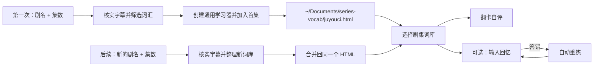

<div align="center">

# 剧有词

### 看一集，学几句。

给出美剧剧名和集数，把这一集的词库加入你的通用 HTML 学习器。

[下载体验页](https://github.com/Chase-qisiai/juyouci/raw/refs/heads/main/examples/demo.html) · [安装到 Codex](#安装到-codex) · [使用方法](#使用)


</div>

**剧有词**从指定剧集的真实字幕中挑选实用表达，加入同一个通用 HTML 学习器。第一次创建学习器并加入首集后，后续每集会合并到这个文件；打开页面即可切换词库练习。默认用翻卡自评，也可以切换到根据中文提示输入英文、自动判题和重练。

> 示例页使用 8 个原创句子演示功能，不来自任何剧集。

## 学习流程


```mermaid
flowchart LR
    A[第一次：剧名 + 集数] --> B[核实字幕并筛选词汇]
    B --> C[创建通用学习器并加入首集]
    C --> D[~/Documents/series-vocab/juyouci.html]
    E[后续：新的剧名 + 集数] --> F[核实字幕并整理新词库]
    F --> G[合并回同一个 HTML]
    D --> H[选择剧集词库]
    G --> H
    H --> I[翻卡自评]
    H --> J[可选：输入回忆]
    J -->|答错| K[自动重练]
    K --> J
```

每条词汇卡包括目标词、音标、语境释义、原句和译文。翻卡自评是默认方式；输入回忆会隐藏原句中的目标表达，检查输入并安排错词重练。可接受的拼写或表达变体由词库明确列出。每个剧集词库独立保存练习进度。

## 安装到 Codex

macOS / Linux 上执行：

```bash
git clone --depth 1 https://github.com/Chase-qisiai/juyouci.git ~/.codex/skills/juyouci
```

如果已安装，进入技能目录执行 `git pull` 更新。安装后在新任务里这样使用：

```text
使用 $juyouci，为我生成 The Pitt S01E01 的 HTML 词汇学习页。
```

也可以直接把字幕或剧本文字提供给 Agent。其他支持 Skills 的 Agent，将整个仓库放入它的个人 Skills 目录即可。

## 使用

默认每集整理最多 50 条中文词汇，字幕材料不足时按实际内容生成，不凑数量。已有字幕会直接使用；拿到一份可靠来源后就开始整理，不会为了收集多份来源而延长流程。

```text
用剧有词生成《The Pitt》S01E01 词库，加入我的学习器。
```

首次使用时，学习器保存在 `~/Documents/series-vocab/juyouci.html` 并包含首集词库。以后提出新剧集，Agent 会把新词库自动合并回同一个文件，交付更新后的 HTML 并说明已加入哪一集；你不需要手动导入 JSON。如果这个文件已经在浏览器打开，重新打开更新后的文件即可看到新词库。若 Agent 找不到已有学习器或无法读取它，会向你索要原文件路径或文件，不会另建一个空库覆盖原有内容。

双击 `juyouci.html` 即可学习。网页不依赖 Anki、服务器或网络；无需安装 Python。页面默认使用翻卡自评，可在页面中切换“输入回忆”；这个选择会保存在当前浏览器并应用于所有词库。HTML 文件包含整套词库，复制它即可备份词库；练习进度和模式偏好保存在浏览器，需要用页面的进度备份功能另行导出。换浏览器、设备或移动文件时，本地数据不保证自动跟随，完整迁移需要带上 HTML 和进度备份。设备语音是否可用取决于浏览器。

## 适用范围

- 目前面向英美剧单集词汇学习。
- 字幕来源和内容必须能核实到指定剧集；找不到可靠字幕时，Agent 会请你提供字幕，不会凭记忆造台词。
- 只保存精选学习例句，不把整集字幕打包进网页。
- 网页支持多剧集词库选择与错词重练；目前不提供跨天的 FSRS / Anki 式复习排程。
- “本轮答对”表示这次输入正确，不代表已经长期记住。

## 手动生成

需要 Python 3 的标准库来校验词库并合并到通用学习器；学习者只需浏览器。

```bash
python3 scripts/build_html.py examples/demo.json study.html
```

词库数据格式见 [references/data-format.md](references/data-format.md)。页面使用 `vocab-library` 内嵌整个词库集合；交付的 HTML 不需要 JSON 或其他文件伴随。维护者手动生成演示页时仍可从单集 JSON 创建 HTML。

## 项目结构

| 路径 | 用途 |
|---|---|
| `SKILL.md` | Agent 的触发条件与生成流程 |
| `assets/study.html` | 通用学习器模板 |
| `scripts/build_html.py` | 校验词条并生成学习页 |
| `references/` | 字幕来源与词条格式说明 |
| `examples/demo.html` | 可直接打开的原创示例 |

## 维护者验证

模板或生成器改动时，可以运行：

```bash
python3 -m unittest discover -s tests -p 'test_*.py'
npm install && npm test
```

浏览器交互测试使用本机 Chrome 和 Playwright。2026-09-27 已运行 11 项词库生成/合并测试和 Chrome 离线交互测试，覆盖默认自评、输入模式切换、跨词库偏好、每集进度隔离、HTML 合并更新与旧单词库迁移。设备语音没有做听感验证。

## 来源与许可

本项目由 [pyang5166/gbro-series-vocab](https://github.com/pyang5166/gbro-series-vocab) 改编，将 Anki/Markdown 交付改为独立 HTML 学习页。保留上游 MIT 许可和原作者 狗哥笔记 的版权声明。TypeWords 的练习设计仅作参考，本仓库没有复制其 GPL-3.0 源代码。

## English

**Juyouci** turns TV episode transcripts into vocabulary decks inside one reusable HTML study page. The first use creates the page and adds the first deck; later episodes are merged into the same file. Flashcard self-rating is the default, with optional typed recall and automatic retry. No Anki, server, or runtime dependency is required.
